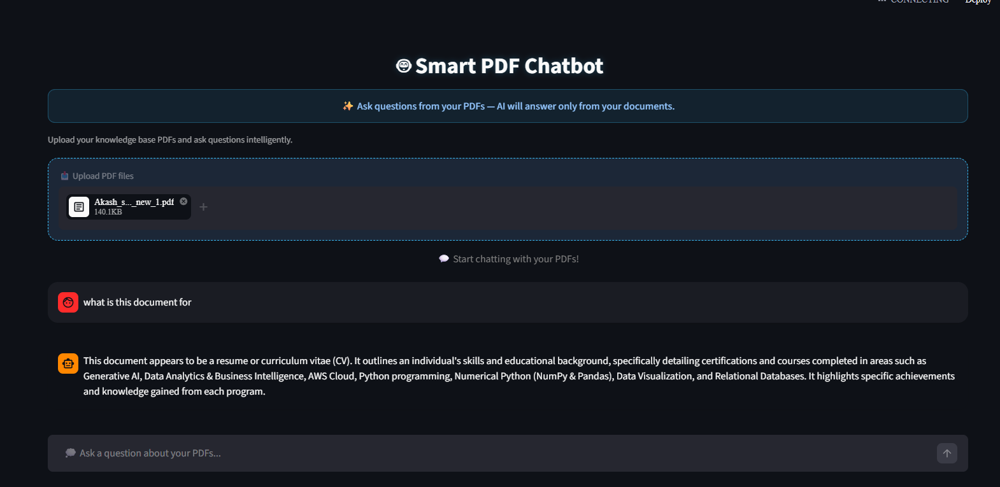

# 🤖 Smart PDF Chatbot

*A Generative AI-powered RAG chatbot for interactive document querying.*

<p align="center">
  
</p>


---

## 📘 Overview

RAG-Based PDF Assistant is an AI-powered application that enables users to interact with PDF documents using natural language.

The application leverages **Retrieval-Augmented Generation (RAG)** by combining **Google Gemini**, **LangChain**, **HuggingFace Embeddings**, and **FAISS** to retrieve relevant information from PDF documents and generate accurate, context-aware responses.

Users can upload a PDF, ask questions related to its content, and receive answers grounded in the document rather than relying solely on the language model's general knowledge.

---

---

## 🚀 Features

* 📄 **PDF Upload & Parsing:** Upload one or multiple PDFs dynamically.
* 🧠 **RAG-based Answering:** Combines vector similarity search with LLM reasoning.
* 💬 **Persistent Chat Sessions:** Save, view, and rename previous conversations.
* 🎨 **Modern UI Design:** Glassy dark theme with rounded chat bubbles and smooth animations.
* 🧾 **Context-Aware Responses:** If an answer isn’t in the PDF, the chatbot clearly explains that.
* 🔄 **Auto-Updating Knowledge Base:** Add, remove, or update documents without reconfiguration.

---

## 🏗️ System Architecture

```
┌──────────────────────────────┐
│        User Interface        │
│  (Streamlit Web App)         │
└──────────────┬───────────────┘
               │
               ▼
┌──────────────────────────────┐
│   RAG Pipeline (LangChain)   │
│  1. Retrieve context chunks  │
│  2. Construct dynamic prompt │
│  3. Generate response (LLM)  │
└──────────────┬───────────────┘
               │
               ▼
┌──────────────────────────────┐
│  Vector Store (FAISS Index)  │
│  + Embeddings (HuggingFace)  │
└──────────────────────────────┘
```

---

## ⚙️ Tech Stack

| Component            | Technology                                                  |
| -------------------- | ----------------------------------------------------------- |
| **Frontend**         | Streamlit                                                   |
| **LLM Integration**  | OpenAI / Gemini / Groq                                      |
| **Text Processing**  | LangChain (`PyPDFLoader`, `RecursiveCharacterTextSplitter`) |
| **Embeddings**       | HuggingFace Sentence Transformers                           |
| **Vector Storage**   | FAISS                                                       |
| **State Management** | Streamlit `session_state`                                   |
| **Styling**          | Custom CSS (dark glassy theme)                              |

---

## 🧩 Project Structure

```
📂 Smart-PDF-Chatbot/
├── app.py                        # Streamlit UI + main logic
├── rag_pipeline.py               # RAG retrieval and generation logic
├── vectorstore_manager.py        # Embedding & FAISS handling
├── chat_Gemini.py                # LLM client wrappers
├── session_manager.py            # Chat session handling
├── history_manager.py            # Saves chat history
├── data/                         # Uploaded PDFs
└── requirements.txt              # Dependencies
```

---

## ⚙️ Installation & Setup

### 1️⃣ Clone the Repository

```bash
git clone https://github.com/AlokSarwade2002/RAG-Based-PDF-Assistant.git
```

### 2️⃣ Create Virtual Environment

```bash
python -m venv venv
venv\Scripts\activate    # On Windows
# OR
source venv/bin/activate # On Mac/Linux
```

### 3️⃣ Install Dependencies

```bash
pip install -r requirements.txt
```

### 4️⃣ Add Your API Key

Create a `.env` file in the project root and add your key:

```
OPENAI_API_KEY=your_api_key_here
# or
GEMINI_API_KEY=your_api_key_here
# or
GROQ_API_KEY=your_api_key_here
```

*(Make sure `.env` is added to `.gitignore` to protect your key)*

### 5️⃣ Run the App

```bash
streamlit run app.py
```

Then open your browser at `http://localhost:8501/`

---

## 💬 How It Works

1. **Upload PDFs:**
   PDFs are stored under the `data/` folder and processed by LangChain’s `PyPDFLoader`.

2. **Vector Embedding:**
   Each document is chunked, embedded using HuggingFace models, and stored in a FAISS vector index.

3. **Query Flow:**

   * User asks a question.
   * Relevant chunks are retrieved from FAISS.
   * LLM generates an answer **grounded in PDF context**.
   * If the answer isn’t in the document, it politely informs the user.

4. **Session:**
   You can rename chats manually in the sidebar.

---

## 🧾 Example Interaction

**User:**

> what is this document for?

**Bot:**

> This document appears to be a resume or curriculum vitae (CV). It outlines an individual's skills and educational background, specifically detailing certifications and courses completed in areas such as Generative AI, Data Analytics & Business Intelligence, AWS Cloud, Python programming, Numerical Python (NumPy & Pandas), Data Visualization, and Relational Databases. It highlights specific achievements and knowledge gained from each program.

---

## 🔄 Knowledge Base Updates

* To **add new PDFs**, simply upload them via the UI.
  → The embeddings and FAISS index update automatically.

* To **update or replace documents**, re-upload the updated file.
  → The system re-embeds only that document.

* To **remove old data**, delete the PDF from the `data/` folder.
  → On the next session, the chatbot reflects the change.

No retraining or reconfiguration required.


---

## 🧠 Future Improvements

* 🔍 Add keyword-based question suggestions from the PDF
* 💾 Persistent FAISS index storage between runs
* 🧩 Multi-user session isolation
* 🗑 Chat delete & export options

---

## 🤝 Contributing

Contributions are welcome!

1. Fork the repo
2. Create your feature branch
3. Submit a pull request

---

## 👨‍💻 Author

**Alok Sarwade**
📊 Data scientist | 💡 AI & Data Science Engineer

📧 Linkedin [https://www.linkedin.com/in/alok-sarwade-datascience/]
